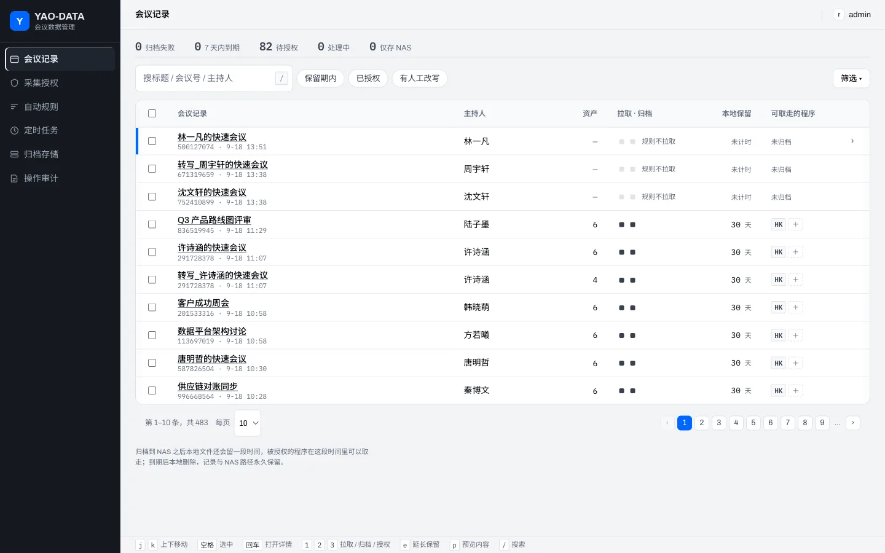
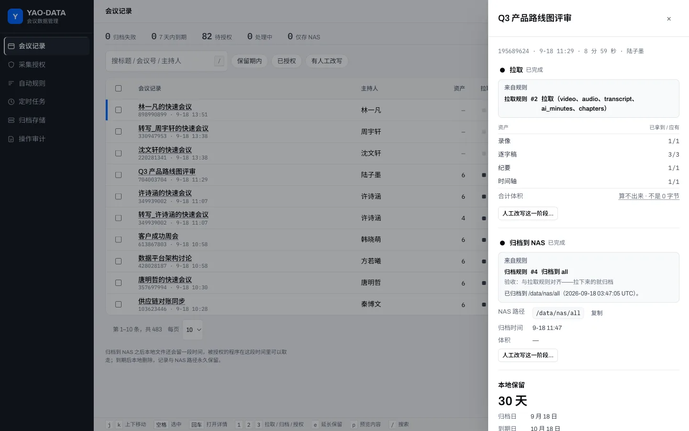
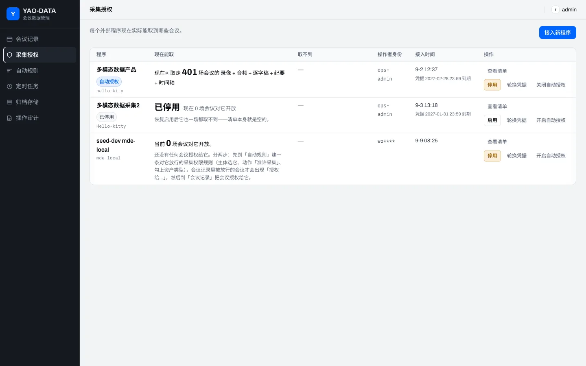
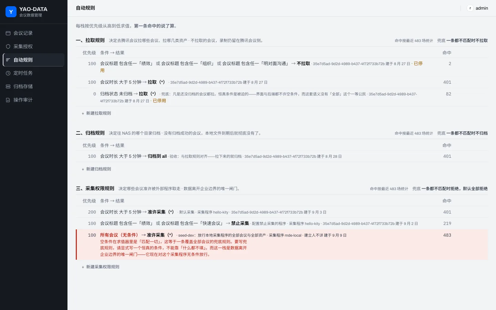
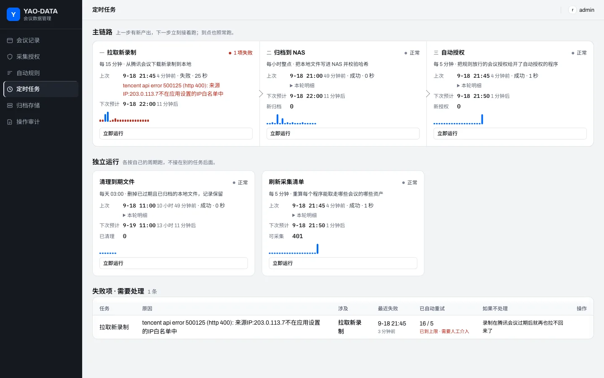
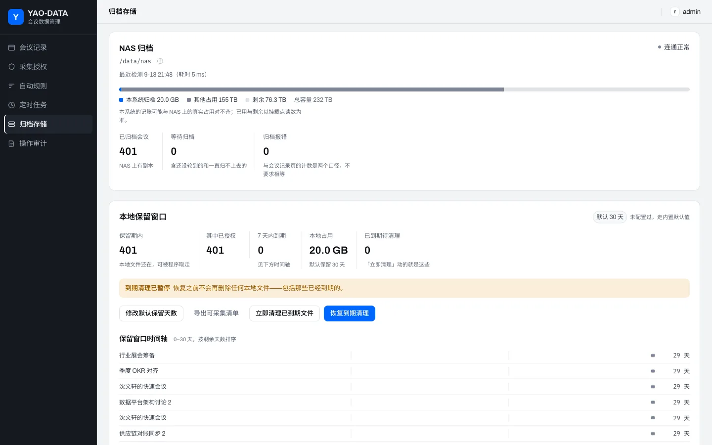
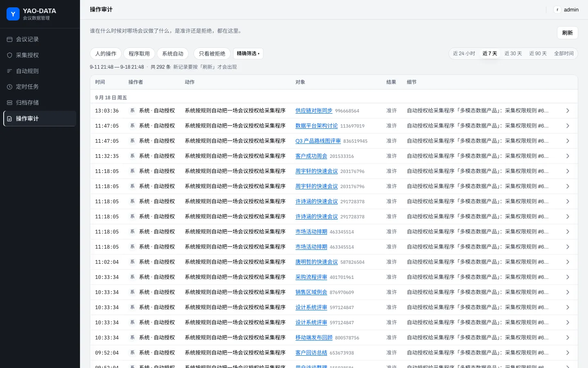
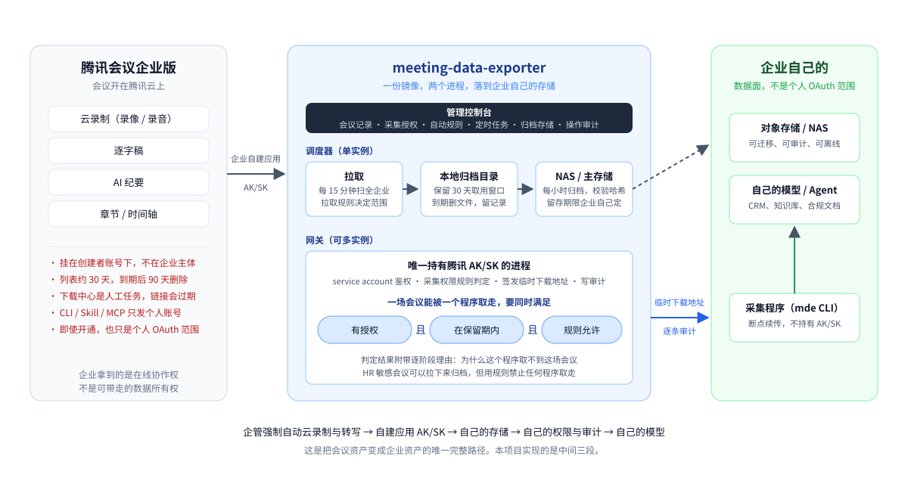

# meeting-data-exporter

把腾讯会议企业版的录制、逐字稿、AI 纪要自动导出到企业自己的存储，归档到 NAS，再按规则和授权向采集程序与企业自己的 AI 提供受控访问。

[](LICENSE)


> 企业版的会议开在腾讯云上，录制和转写留在腾讯侧、挂在员工个人账号下，到期即删。官方给 AI 的入口（CLI / Skill / MCP）不发给企业账号。



## 目录

- [为什么需要它](#为什么需要它)
- [它做什么](#它做什么)
- [界面](#界面)
- [架构](#架构)
- [快速开始](#快速开始)
- [配置与外部依赖](#配置与外部依赖)
- [仓库结构](#仓库结构)
- [文档索引](#文档索引)
- [已知限制](#已知限制)
- [许可证](#许可证)

## 为什么需要它

腾讯会议企业版的问题分两类。一类是资产权，录制和转写留在腾讯侧、挂在员工个人账号下，到期即删，企业没有自动落盘的官方能力。另一类是 AI 接入，官方的 CLI、Skill、MCP 面向个人账号，企业账号申请灰度也只拿到个人 OAuth 范围。下面按产品事实逐条列出。

### 一、归档与资产权：数据不在企业自己的存储里

| # | 痛点 | 产品事实 | 对企业意味着什么 |
| --- | --- | --- | --- |
| 1 | 没有定期、自动落到企业存储的官方能力 | 企管后台只能人工勾选、异步打包、下载中心取件，文件会过期。没有按天或按周扫全企业并写入企业网盘或对象存储的功能。想自动化只能自建应用拿 AK/SK 自己落盘，下载地址会过期，账户级列表接口约每分钟 10 次限流 | 归档靠人手动操作，漏掉的一周没有机制补回 |
| 2 | 留存期限不统一，过期即删 | 个人中心的已结束会议约 30 天，会后文档约 30 天，聊天只在本机缓存、不漫游，企业账号到期后云录制约再留 90 天。额外存储是加购项。"无限云存储" 指空间额度，不是永久可导出 | 企业无法规定一个统一的保留期 |
| 3 | 资产挂在创建者名下，不挂在企业主体 | 录制、转写、纪要默认归会议预定者。主持人不是创建者时多数只能看。员工用个人账号开会，企业后台看不见。离职要手动"继承"，漏配即随账号消失 | 员工离开，会议资产随账号消失 |
| 4 | 可导字段撑不起考勤与合规 | 创建者端名单只有昵称、首次进入、最后退出、次数、时长、身份。UserID、手机号、邮箱只在企管自定义导出里。显示名可改，同一人反复进出不合并 | 名单不能直接当考勤或合规凭证 |
| 5 | 聊天几乎不是企业数据 | 默认没有聊天导出，Webinar 聊天官方标注暂不支持导出。全文需要开聊天存档并走管理员 API，且只覆盖公共聊天 | 会中的决定和链接只留在个人电脑上 |
| 6 | 转写不是事后能补的完整资产 | 会中没开转写就没有文字。方言、纯英文有限制，鸿蒙导出弱，移动端不能改逐字稿 | 没有转写，归档和 AI 处理都没有输入 |

没有进企业存储的资产仍在腾讯侧、在创建者账号下。企业能登录查看，但没有可迁移、可审计的副本。

### 二、对 AI 不友好：官方入口不面向企业账号

| # | 痛点 | 产品事实 | 对企业意味着什么 |
| --- | --- | --- | --- |
| 7 | CLI / Skill / MCP 默认不接企业版 | 个人版、专业版已开放。商业版、企业版需要提交灰度申请等待审批。Skill 专区取 Token 必须用个人账号，企业账号提示不在灰度范围内 | 企业版账号用不了 AI 入口，只能用个人号 |
| 8 | 灰度批了也不是企业数据面 | CLI 和 MCP 用 OAuth 用户身份，只能碰该用户有权看的会议。不能作为企业服务账号扫全公司录制与纪要。超级管理员的 Token 也拿不到全量归档接口 | 每个 Token 只覆盖一个人的权限，没有企业级的 Token |
| 9 | 开放的是会后只读片段 | 能做：约会、改会、取消、录制列表、下载地址、转写、关键词、智能纪要。不能做：会中实时转写流、把会中 AI 助手对接到自己的模型、默认把聊天喂给 Agent | 企业 Agent 只能在会后读到部分数据 |
| 10 | 腾讯纪要替代不了企业自己的模型产出 | 智能纪要接口返回腾讯侧摘要。按内部模板抽待办、对接 CRM、生成合规文档，必须把转写拉回来用自己的模型处理。企业版被 #7 挡住，只剩 REST API 一条路 | 要用自己的模型，得先通过 REST API 把转写拉回来 |
| 11 | 权限模型让 Agent 看得见会、拿不到字 | 创建者没开允许下载、没开转写、分享范围受限、Token 不是创建者，接口直接返回无权限 | Agent 能读到什么取决于每个创建者的设置 |

### 两条结论

| 结论 | 支撑机制 |
| --- | --- |
| 不能定期自动归档。没落到企业存储的资产企业拿不走 | 无官方定时全量归档；留存期限分叉；资产在创建者账号；下载中心是人工任务；聊天与文档默认不进企业库 |
| CLI / Skill 不能用于企业版 | 企业账号拿不到 Skill Token；商业版、企业版需灰度；即使开通也只是个人 OAuth 范围 |

要同时解决这两类问题，只有一条路径：

```
企管强制自动云录制 + 转写 + 智能录制
  → 自建应用 AK/SK（以企业身份拉取，不是个人 OAuth）
  → 自己的对象存储 / NAS
  → 自己的权限判定与审计
  → 自己的模型、Agent、知识库
```

CLI 和 Skill 只能作为个人助手的补充。没有这条链路，企业拿到的只是在线开会的能力，资产留在腾讯侧，Agent 也没有企业级接口可调。

本项目实现的是这条路径里从腾讯会议到企业存储、再到受控出口的部分。

## 它做什么

一个调度器每 15 分钟以企业自建应用身份扫描全企业录制，把录像、录音、逐字稿、AI 纪要、章节五类资产下载到本地，每小时归档到 NAS 并校验哈希。一个网关向采集程序和企业自己的 AI 提供受控 API。一个控制台让管理员配置规则、授权和查看审计。

| 痛点 | 本项目的做法 |
| --- | --- |
| #1 无自动归档 | 调度器按拉取规则定时扫描全企业，已导出的不重复拉取。未生成的资产自动轮询直到就绪或超时 |
| #2 留存期限不统一 | NAS 是主存储，留存期限由企业自己决定。本地保留 30 天作为程序取用窗口，到期删除本地文件，数据库记录与 NAS 路径永久保留 |
| #3 资产挂在创建者名下 | 以企业自建应用身份拉取，不依赖创建者账号。归档目录按归档规则组织，不按账号组织 |
| #6 转写缺失 | 转写类型的录制单独识别。缺失情况进入失败项表，附带原因与影响说明 |
| #7 #8 官方 AI 入口不面向企业 | 网关以 service account 为主体提供 API，范围是全企业已归档的资产，不受个人 OAuth 范围限制 |
| #10 要用自己的模型处理转写 | 转写与纪要作为文件落在 NAS 和本地目录，采集程序通过网关取走后可接任何模型 |
| #11 Agent 拿不到数据 | 访问权限由管理员在控制台配置。判定结果附带逐阶段理由，能回答"为什么这个程序取不到这场会议" |

另外补上官方没有的三项能力。

**访问控制。** 一个程序能取到一场会议的资产，要同时满足三个条件：这场会议授权给了这个程序，本地文件仍在保留期内，采集权限规则判定为允许。三个条件由不同页面分别维护。文件只有经采集权限规则放行才会交给程序。用一条高优先级的拒绝规则，就能让绩效、薪资、期权、组织调整这类 HR 会议照常拉取归档，但任何程序都取不走。

**凭证隔离。** 腾讯 AK/SK 只有调度器进程使用。采集程序用 service account 向网关认证，网关完成鉴权、规则判定与审计后签发指向自己的临时下载地址，文件从本地归档或 NAS 直出。采集链路不碰腾讯接口，采集方的机器上没有腾讯凭证。

**操作审计。** 登录、拉取、归档、授权、取用全部写入审计表。审计页按天分组展示，不合并记录。

本项目不处理参会名单、聊天记录、会后文档（痛点 #4、#5），见[已知限制](#已知限制)。

## 界面

截图取自本地演示环境，姓名、会议标题、会议号均为合成数据。

**会议详情。** 一场会议的拉取、归档、授权三个阶段各自的状态、命中的规则、NAS 路径与保留期。每个阶段都可以人工改写。



**采集授权。** 每个外部程序现在能取到多少场会议、取不到的原因、谁接入的。停用、轮换凭据、开关自动授权都在这一页。



**自动规则。** 三个规则栈：拉取规则决定拉哪些会议和哪几类资产，归档规则决定写到 NAS 的哪个目录，采集权限规则决定哪个程序能取走什么。每条规则显示当前命中的会议数。



**定时任务。** 主链路拉取、归档、自动授权，上一步有新产出时下一步立即执行。失败项单独列出，附带原因、影响范围和自动重试次数。



**归档存储。** NAS 连通状态与容量，本地保留窗口内的会议数与占用，到期清理可暂停。



**操作审计。** 谁在什么时候对哪场会议做了什么，按天分组，可从一条记录出发缩小筛选。



## 架构



| 组件 | 位置 | 职责 |
| --- | --- | --- |
| 网关 `gateway` | `src/` | JWT 鉴权、企微设备授权登录、身份映射、采集权限判定、签发临时下载地址、从本地归档或 NAS 直出文件、写审计。只读调度器写好的库与盘，不调腾讯接口。托管控制台静态页。可多实例 |
| 调度器 `scheduler` | `src/worker/scheduler.ts` | 五个定时任务。主链路：拉取新录制（每 15 分钟）、归档到 NAS（每小时）、自动授权（每 5 分钟）。独立任务：清理到期文件（每天 03:00）、刷新采集清单（每 5 分钟）。全系统只能运行一个实例 |
| 管理控制台 | `console/` | React 单页应用，构建产物由网关托管，不是独立服务。角色：admin / readonly |
| mde CLI | `client/` + `packages/engine` | 采集程序的参考实现。通过网关发现调度器已存下的会议并下载资产到本地，支持断点续传与崩溃恢复 |

几个设计决定：

- 规则引擎分三个栈，全部默认拒绝，拒绝优先。前两栈由调度器读取，第三栈由网关读取。管理员可对单场会议做人工改写，改写只替换规则判定结果，授权是独立条件。
- 采集权限的主体是程序，不是人。企微用户可以登录控制台，但不是 service account，请求取数时直接拒绝。
- 调度按时间片，不补跑。停机期间错过的时间片不补跑，上一轮未结束时不启动新一轮，并写一行 skipped 记录。
- 失败分两层。整轮抛异常时该轮标记失败。轮内单个对象失败时该轮仍算成功，失败对象进入失败项表。
- CLI 用 SQLite 作任务队列。中断后重跑同一条命令即可继续，已完成的资产不重复下载。
- 周期会议按录制记录拆分场次，每场一个目录。

技术栈：Bun + TypeScript（服务端、CLI、引擎），MySQL 8.0（JSON 列、`SKIP LOCKED` 队列、`GET_LOCK` 迁移互斥，必须 utf8mb4），React 19 + Vite（控制台），Docker Compose（部署）。

## 快速开始

需要 Docker 与 Docker Compose v2。

```bash
git clone https://github.com/joesmart/meeting-data-exporter.git
cd meeting-data-exporter

# 1. 准备配置。必填：腾讯会议五项凭证、JWT_SECRET、GATEWAY_BASE_URL、
#    IDENTITY_STRATEGY、宿主机目录 MDE_ARCHIVE_ROOT 与 MDE_NAS_ROOT。
#    DATABASE_URL 留空则使用 compose 自带的 MySQL。
cp .env.example .env
$EDITOR .env

# 2. 构建并启动（镜像包含已编译的控制台）
docker compose up -d --build

# 3. 自检凭证、数据库、目录、企微配置
docker compose exec gateway bun scripts/preflight.ts

# 4. 创建管理员账号（密码至少 8 位；命令前加空格可避免写入 shell 历史）
 docker compose exec gateway bun scripts/admin-bootstrap.ts --username admin --password '<密码>'

# 5. 访问控制台
open http://localhost:3000
```

`.env` 包含真实凭证，已被 `.gitignore` 与 `.dockerignore` 排除。不要提交，不要粘贴到聊天或工单。

采集程序在控制台"采集授权"页创建 service account 后，用 `mde` 取数：

```bash
export MDE_GATEWAY_URL=http://localhost:3000
export MDE_CLIENT_ID=...       # 控制台签发
export MDE_CLIENT_SECRET=...   # 仅展示一次，服务端只存哈希
bun client/bin/mde.ts run --from 2026-09-01 --to 2026-09-14 --out ./export
```

`mde` 列出的是调度器已经存进网关的会议，不是腾讯此刻有的会议。调度器每 15 分钟拉最近 24 小时（`MDE_SCHEDULER_FETCH_LOOKBACK_HOURS`），资产下载完成后才出现在清单里。上线前 24 小时以前的会议要先让调度器补跑那段窗口，`mde` 才能看到。凭证存放、历史窗口补跑、日常 cron、排错与网关接口契约见 [`docs/collector.md`](docs/collector.md)。

非 Docker 部署、阿里云 RDS 注意事项、`preflight` 完整说明、初始规则模板见 [`docs/deploy.md`](docs/deploy.md)。

## 配置与外部依赖

配置通过环境变量注入，`src/config.ts` 在启动时校验，缺项则拒绝启动。完整清单见 [`.env.example`](.env.example)。

| 依赖 | 变量 | 说明 |
| --- | --- | --- |
| 腾讯会议企业自建应用 | `TM_APP_ID` `TM_SDK_ID` `TM_SECRET_ID` `TM_SECRET_KEY` `TM_OPERATOR_ID` | 仅网关与调度器进程持有 |
| MySQL 8.0 或更高 | `DATABASE_URL` | 建库必须显式指定 utf8mb4。留空则使用 compose 自带实例 |
| 本地归档目录 | `MDE_ARCHIVE_ROOT` | 下载落盘与 30 天保留窗口所在目录，必须存在且可写 |
| NAS 挂载点 | `MDE_NAS_ROOT` | 主存储。compose 下填宿主机路径，挂载进容器 |
| 企业微信自建应用（可选） | `WECOM_*` | 控制台企微登录。全填或全不填 |
| 身份映射策略 | `IDENTITY_STRATEGY` | `direct` / `email` / `table`，企微用户到腾讯会议 userid 的映射方式 |
| 时区 | `MDE_SCHEDULER_TZ_OFFSET_MIN` | 决定"每天 03:00 清理"的时区。东八区填 `480` |

Docker Compose 相关变量（端口、运行用户 uid/gid、MySQL 密码与数据目录）见 `.env.example` 末尾。

## 仓库结构

```
src/                 网关 + worker（同一份代码，两个入口）
  index.ts           网关进程入口
  worker/scheduler.ts  调度器进程入口（单实例）
  worker/index.ts    一次性 worker（补跑历史窗口，docs/collector.md 第 4 节）
  auth/ policy/ catalog/ audit/ tencent/ store/ http/ domain/
migrations/          001..016，网关与调度器启动时自动执行
scripts/             preflight、admin-bootstrap、密码重置、数据回填等运维脚本
console/             管理控制台（独立 npm 项目，构建产物由网关托管）
client/              mde CLI
packages/engine/     导出引擎（CLI 与服务端 worker 共用）
docs/                部署手册、产品说明书、设计文档、README 用图
docker-compose.yml   单机部署
```

常用命令：

```bash
bun install
bun run dev          # 网关，热重载
bun run scheduler    # 调度器
bun test             # 服务端测试
bun run typecheck
cd console && npm ci && npm run dev    # 控制台开发
```

## 文档索引

| 文档 | 内容 |
| --- | --- |
| [`docs/deploy.md`](docs/deploy.md) | 部署手册：MySQL 准备、腾讯会议与企微后台配置、身份映射策略、采集权限规则模板、Docker Compose、preflight、错误码对照 |
| [`docs/console/spec.md`](docs/console/spec.md) | 控制台功能说明书：产品模型、页面行为、规则引擎语义、系统状态与降级、已知缺口 |
| [`docs/roadmap.md`](docs/roadmap.md) | 里程碑 M1 到 M6 与状态 |
| [`docs/superpowers/specs/2026-07-20-meeting-export-gateway-design.md`](docs/superpowers/specs/2026-07-20-meeting-export-gateway-design.md) | 网关设计与安全模型 |
| [`docs/superpowers/specs/2026-07-23-export-engine-cli-design.md`](docs/superpowers/specs/2026-07-23-export-engine-cli-design.md) | 导出引擎与 CLI 设计 |
| [`docs/superpowers/specs/2026-07-20-user-stories.md`](docs/superpowers/specs/2026-07-20-user-stories.md) | 用户故事 |
| [`docs/collector.md`](docs/collector.md) | 采集程序调用手册：数据口径、凭证存放、首次全量与历史窗口补跑、日常 cron、排错、网关接口契约 |
| [`client/README.md`](client/README.md) | `mde` CLI 命令与参数 |

## 已知限制

- 只导出录像、录音、逐字稿、AI 纪要、章节五类资产。不导出参会名单、聊天记录、会后文档（痛点 #4、#5），这些需另走企管自定义导出或聊天存档 API。
- 仅支持腾讯会议企业版的企业自建应用（AK/SK）模式。不支持其他会议平台，不支持 OAuth 第三方应用模式。
- 调度器只能运行一个实例。网关可横向扩展。
- 网关只向采集程序提供调度器已经下载完成的资产。腾讯侧已有但本地还没下完的资产不在清单里，`mde` 下一轮会补上。本地副本被保留策略清掉后，网关改从 NAS 直出。
- 其他已知缺口见 `docs/console/spec.md` §11。

## 许可证

[MIT](LICENSE)
