# 控制台功能说明书

- 日期：2026-08-23
- 状态：原型已定稿，待评审后进开发
- 所属：yaowu-ai / meeting-data-exporter · 控制台（子项目 5）
- 范围：本文档定义**管理员 Web 控制台**的产品行为。网关侧要补哪些能力见
  [`backend-gap.md`](backend-gap.md)；视觉与交互规范见 [`design-system.md`](design-system.md)
- 原型：[`prototype/gate-console.html`](prototype/gate-console.html)

---

## 0. 这份文档怎么用

原型是**行为的唯一权威**：文字与原型冲突时，以原型为准，并回来改文字。
文档负责讲清原型讲不出来的东西——为什么这么设计、边界条件、以及后端要保证什么。

**原型里的数字全是编的。** 会议数、NAS 容量、任务耗时、规则命中数都是示例值。

---

## 1. 产品模型

一句话：**把腾讯会议的录制与纪要收进来，归档进 NAS，在本地留一个窗口期，
期间按规则和授权让外部程序取走；窗口期一到删本地文件，只留记录和 NAS 路径。**

### 1.1 四个阶段

```
腾讯会议
   │
   │ ① 拉取        由「拉取规则」决定拉哪些会议、拉哪几类资产
   ▼
本系统本地
   │
   │ ② 归档 NAS    由「归档规则」决定进 NAS 的哪个目录
   ▼
NAS（长期唯一存放地）
   │
   │ ③ 本地保留 30 天    自**归档成功**日起算，不是自会议日起算
   │    这期间外部程序可以取
   ▼
   ④ 到期            删本地文件，保留数据库记录 + NAS 路径
```

登录页底部那条点线就是这四个阶段，不是装饰。

### 1.2 NAS 是主存储，不是备份

这是整套系统最容易被误解的一点，也是所有告警等级的来源：

> **没有归档成功的会议，本地保留期一到就彻底没有了。**

腾讯会议侧的录制有自己的留存策略，不能假定它一直在。所以：

- **归档失败是本系统最高级别的告警**，红色，且在会议列表的分诊条里单列一格
- NAS 断连时，控制台**提供「暂停到期清理」的应急开关**（见 §7.2）——那是唯一能
  阻止不可逆损失的动作，所以它必须出现在告警条本身上，而不是藏在设置里

### 1.3 外部程序真能取到 = 三个「与」

```
有授权（这场会议授权给了这个程序）
  且  在保留期内（本地文件还没被删）
  且  规则允许采集（权限规则栈判定 allow）
```

三个条件缺一不可，且**分别由不同的人、在不同的页面维护**。界面必须随时能回答
「为什么这场会议这个程序取不到」——所以每场会议的详情里都有逐阶段的**判定理由**
（`why.fetch` / `why.archive` / `why.allow`）。

### 1.4 数据出企业边界的唯一闸门

**采集权限规则是数据离开企业边界的唯一闸门。** 任何新增的出境路径（例如把会议
内容送给大模型做问答）都必须走同一道闸门，不能从别的页面另开一个口子。

原型的内容预览页右下角为「向这场会议提问」留了位置但**刻意没有实现**：那是一条
新的出境路径，真要接就当一个采集程序来管——走接入向导拿凭据、受规则和授权约束、
每次问答记一条审计。

**这条理由记在这里和 §10，不写在界面上**（2026-08-28）。此前内容预览页右下角
渲染着一整块「向这场会议提问 —— 刻意不做」，两段散文解释一个不存在的输入框为什么
不存在。它和 §11 第 7 行的「撤销归档」是同一个错误：拿管理员的注意力去养一条产品
笔记。控制台上不再出现这一块，连那个禁用的输入框也仍然不画——一个点不动的输入框
照样在暗示「这个功能马上就有」，而这是一个**还没做出的决定**，不是一个还没完成的
工期。

---

## 2. 角色与权限

| 角色 | `role` | 能做什么 | 状态 |
| --- | --- | --- | --- |
| **数据管理员** | `admin` | 全部：改规则、改授权、延长保留、手动触发任务、看内容 | ✅ 已实现 |
| **只读角色** | `readonly` | 只能看：全部 GET，加上「改自己的密码」「登出」两条 | ✅ 已实现（阶段 5） |

M2 已确认「**仅管理员可导**」，所以控制台不面向全员。用户菜单里那一行随角色变：
`admin` 是「数据管理员 · 可改规则与授权」，`readonly` 是「只读账号 · 只能查看，不能改」。

**权限在后端，不在界面上。** 18 条非 GET 的 admin 端点逐条拒绝只读账号
（403 `readonly_role`，带一句可以直接显示的中文）；前端把对应的入口禁用掉
（**禁用而不是隐藏**——隐藏会让只读用户以为这个功能不存在），但那一层只是
别让人白点，绕过界面发来的写请求由后端那条 403 挡住。

**`role` 读不出来时按 `readonly` 处理。** 后端认不出的取值在服务端就折成 `readonly`；
前端在 `GET /auth/me` 少了这个键时同样落到只读一侧。两个方向的代价不对称：
落错成只读只是多点一次刷新，落错成管理员是让人以为自己改成了、而后端其实拒了。

**三条非 GET 但允许只读**：`POST /auth/login`（登录时还没有角色可言）、
`POST /auth/logout`（撤销的是自己的会话，挡住它等于只读账号退不出登录）、
`POST /auth/password`（改的是自己的凭据，不是系统状态；挡它防不住任何越权，
只会让怀疑密码泄露的人无法自救）。

**管理员查看会议内容会留痕。** 尤其是被规则禁止采集的会议——管理员仍然能看
（他要判断这条规则拦对了没有），但顶部挂琥珀警示条，且这次查看进审计日志。

---

## 3. 信息架构

左栏**六项**，外加一个不占导航的内容预览页——下表七行，最后一行的 `preview` 不进左栏。

> 原表述是「左栏七项，外加一个不占导航的内容预览页」，与下表七行（含 preview）
> 自相矛盾，会被读成「6 + 1 = 8 页」。原型实测左栏就是 6 个 `nav-item`。
> F1 Task 3 的实现者发现了这处矛盾（2026-08-24）。


| 页面 | `data-view` | 回答什么问题 |
| --- | --- | --- |
| 会议记录 | `meetings` | 每场会议现在处在哪个阶段、还剩几天、谁能取 |
| 采集授权 | `consumers` | 每个外部程序现在实际能取到多少东西 |
| 自动规则 | `rules` | 拉什么、归档到哪、放行什么 |
| 定时任务 | `jobs` | 四个任务跑得怎么样、失败项在哪 |
| 归档存储 | `storage` | NAS 还剩多少、保留窗口里有多少 |
| 操作审计 | `audit` | 谁在什么时候取走了什么 |
| 内容预览 | `preview` | 这场会议里到底讲了什么（从会议记录点标题进入） |

---

## 4. 逐页说明

### 4.1 登录

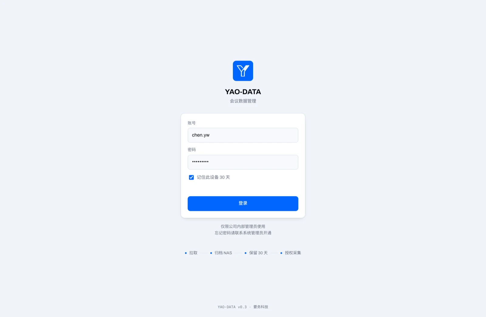

账号 + 密码 + 「记住此设备 30 天」。仅限内部管理员，无自助注册、无找回密码
（文案明说「忘记密码请联系系统管理员开通」）。

**这是独立于企微的账号体系**（D1，2026-08-23），不是待定项——理由见 §10。

- 报错行是**表单级**的（"账号或密码错误" 故意不说是哪个字段错了），常驻占位，
  避免出错时表单跳一行
- 底部四阶段点线是产品模型的可视化，不是进度条

**登录之后：用户菜单**（顶栏右上角，阶段 5 补齐，原 §11 缺口 5）。里面是当前账号名
（来自 `GET /auth/me`，不是写死的）、角色那一行（见 §2）、以及**修改密码**与
**退出登录**两个入口。

修改密码要填**当前密码**——只凭浏览器里那张会话 cookie 就能改密码，等于一次 XSS
就能永久接管账号。改完之后**这个账号在其它设备上的会话会被吊销，当前这一条保留**
（否则改完密码立刻把自己踢下线）；界面上要把被踢下线的会话数说出来，
**0 也要说**（「没有别的设备在登录」是一个结论，不是留白）。密码长度门槛与建号
那条路径共用同一份校验，前端不抄一个数——不够长时后端会说要几位。

### 4.2 会议记录（主页面）

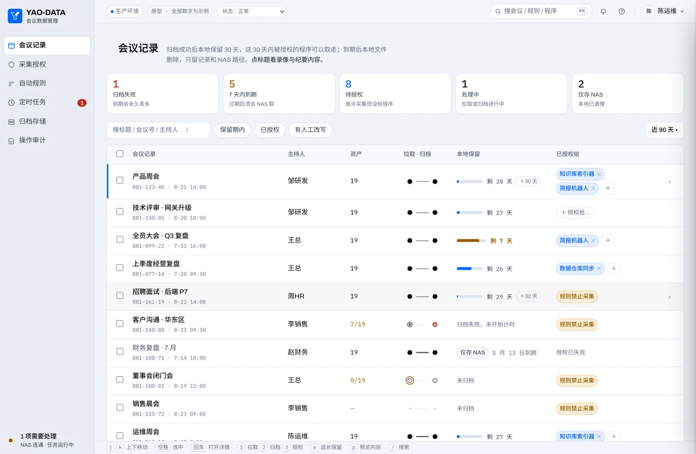

**分诊条**（五格，每格可点即筛选）——把「现在有什么需要处理」压成一行：

| 格 | 含义 | 颜色 |
| --- | --- | --- |
| 归档失败 | 到期会永久丢失 | 红 |
| 7 天内到期 | 过期后须去 NAS 取 | 琥珀 |
| 待授权 | 准许采集但没给程序 | 蓝 |
| 处理中 | 拉取或归档进行中 | 中性 |
| 仅存 NAS | 本地已清理 | 中性 |

**表格列**：

| 列 | 内容 | 说明 |
| --- | --- | --- |
| 会议记录 | 标题 + 会议号 + 时间 | 标题是按钮，点进内容预览 |
| 主持人 | | |
| 资产 | `已拿到/应有` | 如 `19` 或 `7/19`（部分失败）或 `0/19` |
| 拉取 · 归档 | 两个圆点 + 连线 | **圆点即开关**，点一下就能重跑该阶段 |
| 本地保留 | 进度条 + 剩余天数 | hover 出现「+30 天」按钮 |
| 已授权给 | 程序 pill，可加可删 | `+ 授权给…` 打开程序选择弹层 |

- **批量**：勾选后底部浮出批量条（授权 / 延长 / 重跑）
- **跨页全选有逃生门**：勾表头只选本页，要选全部得再点一次，且明说总数
- **人工改写优先于所有规则**，改写过的行有标记

### 4.3 会议详情（右侧抽屉）

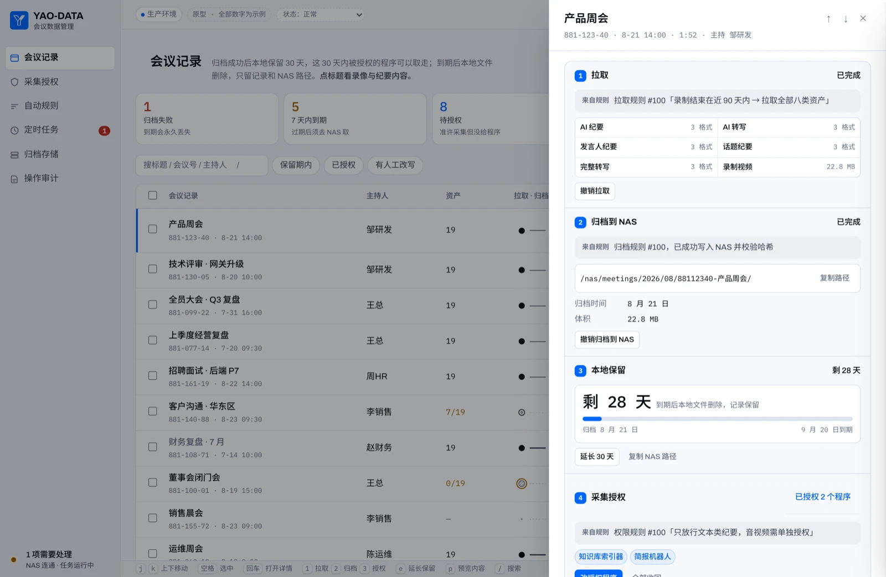

四段，对应产品模型的四个阶段，每段带**判定理由**：

1. **拉取** —— 状态 + 是哪条规则决定的 + 八类资产各自的格式数与体积 + 「撤销拉取」
2. **归档到 NAS** —— NAS 路径（可复制）+ 归档时间 + 体积 + 「撤销归档」<sup>[1]</sup>
3. **本地保留** —— 大号剩余天数 + 归档日/到期日 + 「延长 30 天」
4. **采集授权** —— 已授权程序 + 是哪条权限规则放行/禁止的

底部是**这场会议的操作历史**（谁在什么时候取走了什么）。

> <sup>[1]</sup> **「撤销归档」= 只撤记录，NAS 副本保留**（2026-08-25 定）。
>
> 本文原先没有定义过这个动作的语义。两个选项的后果差距很大：删掉 NAS 副本是**不可逆**的，
> 而 §1.2 已经写明 NAS 是主存储不是备份——一旦本地保留窗口也已过期，撤销归档就等于
> 永久销毁这场会议的全部资产。**按钮看起来只是「重来一次」，实际后果不是。**
>
> 所以定为保留副本：撤销归档是**可逆动作**，不需要二次确认，也不走 §4.9 那套删除前的
> 哈希重校验。代价是归档记录与 NAS 实际文件会不一致，NAS 上会留下没有记录指向的孤儿文件；
> 重新归档时必须能正确处理「目标文件已存在」。清理孤儿文件是另一件事，不在本动作范围内。
>
> 对应 [用户故事 US-2.5](../superpowers/specs/2026-07-20-user-stories.md)，目前 0 实现。

### 4.4 内容预览

从会议列表点标题进入。左纪要、右去向，中间可拖。

> 原型写的是「左纪要、**右录像**」。录像这一路做不出来（见下），所以右栏最后
> 装的是「这场会议的资产与去向」——那本来就是原型给右**下**角安排的内容。

| | |
| --- | --- |
| 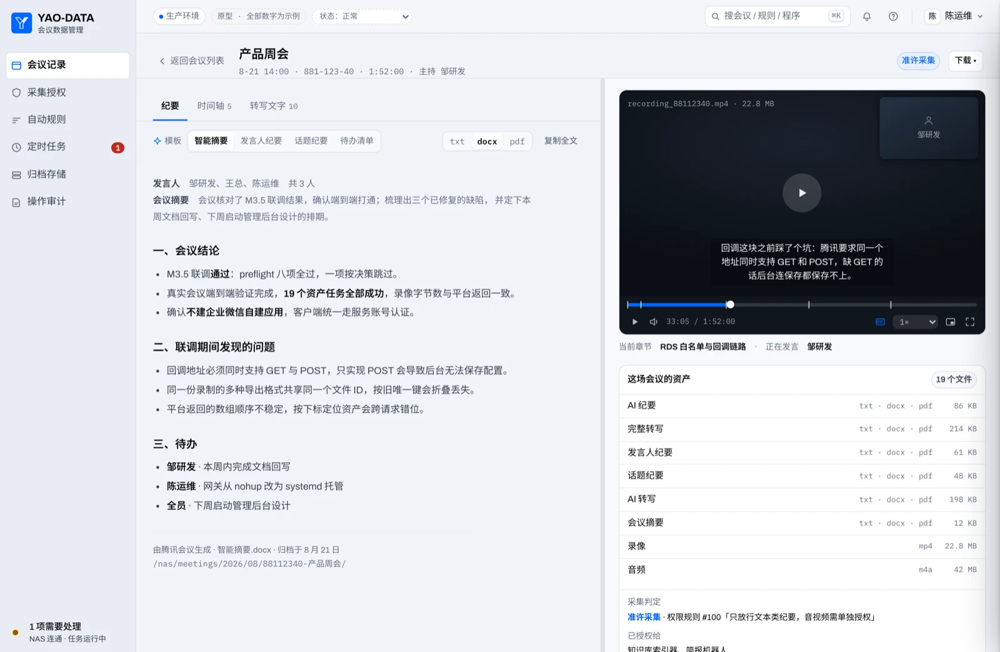 | 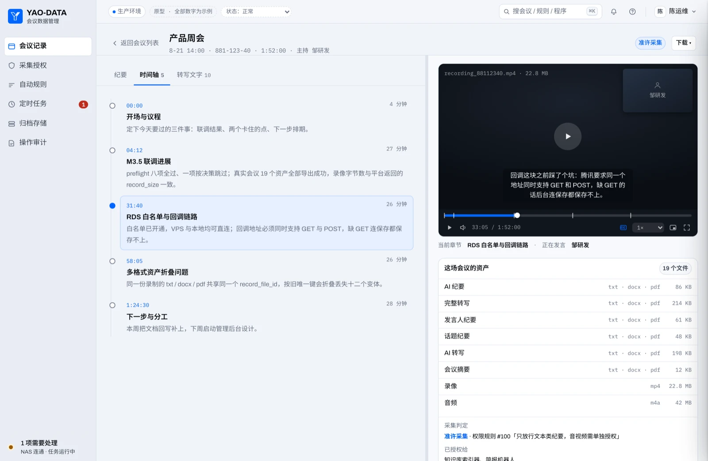 |
| **纪要** —— 带模板切换 | **时间轴** —— 章节 + 摘要，点击跳转 |

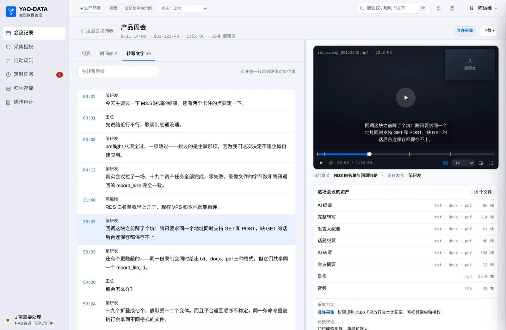

**转写文字** —— 带搜索与命中高亮。

- **三个 tab**：纪要 / 时间轴 / 转写文字
- **纪要有模板切换**：智能摘要 · 发言人纪要 · 话题纪要 · 待办清单。这不是装饰性
  下拉——腾讯确实按不同模板生成多份纪要。右侧跟 `txt / docx / pdf` 格式开关
- **走时条**（原型叫「播放器」）：一条横条 sticky 在 tab 与正文之间，播放/暂停、
  时间码、进度条、字幕开关、倍速 0.5–2×；当前时间、发言人、字幕排在条下面一行
- **三处联动**：点时间轴一段 → 跳转；点转写任意一段 → 跳转；走时时转写自动高亮并
  跟随滚动
- **跟随滚动只滚分段列表那个框，不许滚页面**。2026-08-31 补：这一条原来只写了
  「跟随滚动」，实现上用的是 `scrollIntoView({ block: 'nearest' })`——那个 API 会沿
  祖先链把每一个可滚动容器都滚一遍，一直滚到文档本身，`nearest` 管的是每个容器
  **滚多少**而不是**滚哪几个**。1440×900 实测：一按播放 `window.scrollY` 3.75 秒内
  从 0 被推到 544，录像被顶出屏幕；人手动滚回去看画面，下一段一到就被拽回来。
  跟随是给正文用的，不是给页面用的：滚动条的所有权归人
- **打开时落在 0:00**。原型写死的是「落在会议中段（不是 0:00）——三处当场对得上,
  不用等走两分钟才看出它们是联动的」，2026-08-30 **翻案**：那是给静态原型截图看的
  理由。接上真实数据之后它变成一个纯粹的坑——打开一场会议，进度条已经在正中间,
  前一半看起来像是被跳过了。联动本身没有变弱，只是不再靠一个假的起始位置演示自己
- **右栏是「这场会议的资产与去向」**，不是 AI 问答框：八类资产按类合并成组，
  每组给格式与状态，展开给后端逐条写的理由、逐格式的体积与 NAS 路径；上面四条
  事实——采集判定（及是哪条规则判的）、已授权给谁、本地还剩几天、NAS 路径

**原型这一节里有四句话本系统做不到**，2026-08-28 逐句改掉（此前它们只活在
`Player.tsx` / `MinutesTab.tsx` 的文件头注释里——正是 §11 抬头点名禁止的那种
「缺口只活在一行代码注释里」）：

| 原型这么写 | 实际 | 为什么 |
| --- | --- | --- |
| 「右录像」「播放器」 | **不播放**，只有一条走时的位置游标 | `GET .../content` 的 `media.proxied` 恒为 false（录像单个可以有几个 GB，代理一份等于把网关当 CDN）；唯一能签直链的 `POST /assets/:id/download-url` 走采集程序的 JWT，**管理员会话签不出来**。这一轮控制台拿不到任何可播放的媒体源，所以不画一个点了没反应的播放器 |
| 「进度条上有**章节**标记点」 | 标记点来自**转写时间戳** | 本系统一次都没拉过腾讯的章节数据（T16 裁定，`chapters` 恒空、`source: 'none'`）。给一个我们没有的数据源伪造输出，比没有这些点更糟 |
| 「**画中画、全屏**」 | 两个按钮都**没有** | 它们只对一个真实的 `<video>` 元素成立。做成假的就是「留着一个点了弹『还没做』的按钮」 |
| 模板第四项「**待办清单**」 | 实际是「**会议摘要**」（`ai_ds_minutes`） | 系统里没有任何一个 `asset_type` 装「待办清单」。四个模板必须各自对应一个真实的资产类型——换模板是换一条真实的请求，不是一个装饰性下拉 |
| 「发言人**小窗**」 | 一行文字，跟在走时条下面 | 小窗要有画面才叫小窗；没有画面时它就是「当前这一段是谁在说」这一句话 |

> 腾讯会议那张页面是给参会者读的；这一页是给管数据的人看的。左边一样，右边不一样。

### 4.5 采集授权

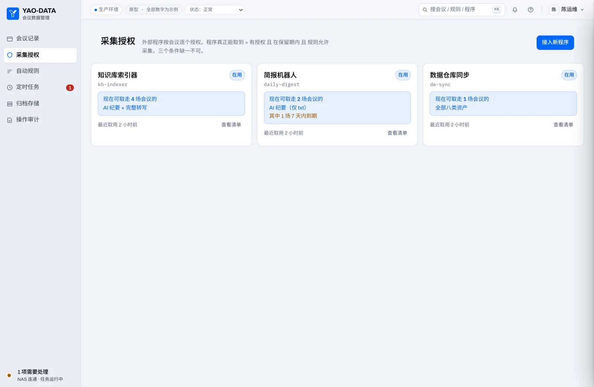

每个外部程序一张卡片。卡片正中间那句蓝底的话是**这一页的全部价值**：

> 现在可取走 **4** 场会议的 AI 纪要 + 完整转写

它是三个「与」条件求交之后的**实际结果**，不是配置值。快到期的会额外用琥珀标出
（「其中 1 场 7 天内到期」）。

**接入新程序 = 四步向导**：

| | |
| --- | --- |
| 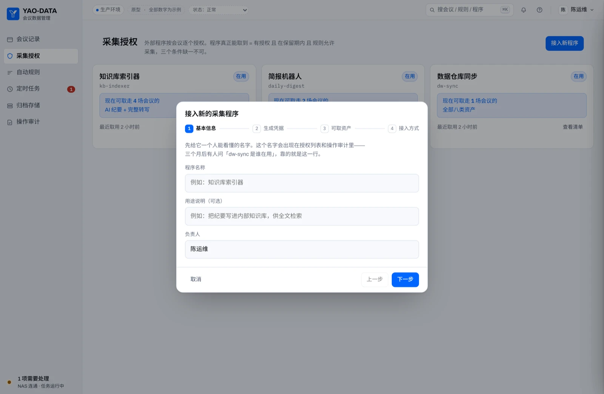 | 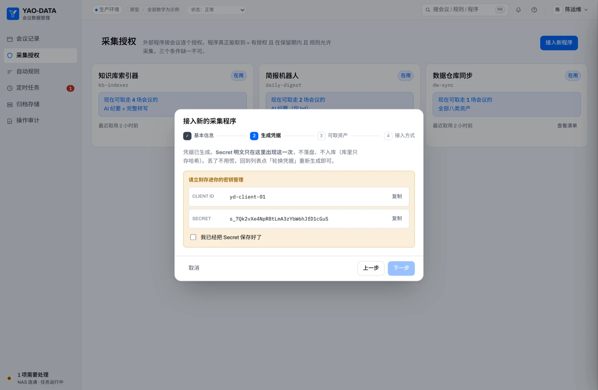 |

凭据**明文只出现一次**，与 `scripts/seed-dev.ts` 的服务账号行为一致（库里只存
argon2id 哈希）。这一点必须在后端保持。

**卡片上还有两个动作**（阶段 5 补齐，原 §11 缺口 4）：

- **停用 / 启用**。停用**立刻生效**，包括那个程序手上已经签发、还没过期的访问令牌
  ——判定在 `AccessGate` 每一次取数时做，不是只在拿凭据换令牌那一层。停用
  **不删任何授权**：它是可逆动作，「停用再启用」不该变成一次不可逆的数据丢失。
- **轮换凭据**。旧凭据当场失效，新明文**只显示这一次**（服务端只存哈希，
  没有也不会有「再看一次」的端点——那等于把哈希存储的意义抵消掉）。所以那一屏
  要勾一个「我已经保存好了」才关得掉，不勾就关会被再问一遍。

**停用的程序，那句蓝底的话换成「已停用 · 现在 0 场会议对它开放」。**
清单端点算的是 授权 ∩ 保留期 ∩ 规则，**不看 `enabled`**，所以它对一个停用的程序
照样算得出「N 场可取」——而网关那一侧会拒。那正是 §1.3 要防的漂移方向
（控制台说准许、程序去取时被拒）。那份「如果它还能登录会是什么样」的清单降到
下面一行，仍然说得出来，但不冒充「现在」。
根治是让 `worker/visibility.ts` 的重算也看 `enabled`，那会牵到调度器那一侧，未做。

### 4.6 自动规则

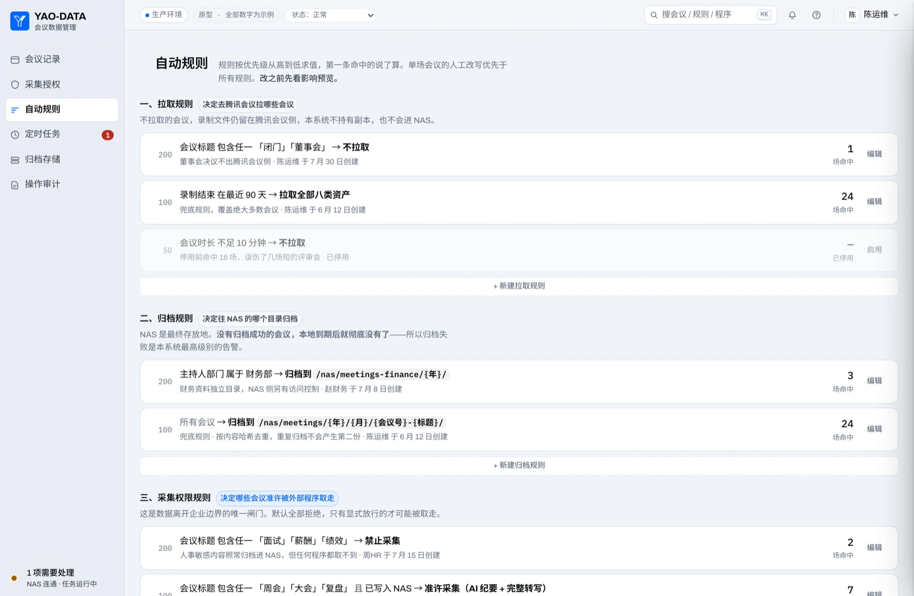

三组规则栈，各管一件事：

| 组 | 决定 | 兜底 |
| --- | --- | --- |
| **一、拉取规则** | 去腾讯会议拉哪些会议、拉哪几类资产 | `skip`（不拉） |
| **二、归档规则** | 往 NAS 的哪个目录归档 | `skip` |
| **三、采集权限规则** | 哪些会议准许被外部程序取走 | **`deny`（默认全部拒绝）** |

第三组的兜底是 deny，前两组是 skip——因为第三组是数据出境闸门，默认必须是关的。

### 4.7 规则编辑器

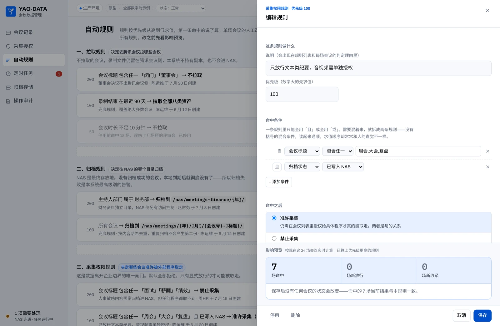

右侧全高面板，比抽屉宽，因为**条件构建器和影响预览必须同屏**。

> 规则的难点从来不是「怎么填」，是「填完之后有多少场会议的状态会变」。

- **条件行**：字段 + 运算符 + 值，连接词在左侧竖排
- **一条规则内只能全用「且」或全用「或」**——这是刻意限制。混用而没有括号，
  读起来通顺，求值顺序却常常和人的直觉不一样。需要混用就拆成两条规则
- **影响预览钉在底部**，不跟正文滚动，三个数：`场命中` / `场新放行` / `场新收紧`
- 有会议**从未对外开放过**却将被这条规则放行时，额外出一条琥珀警告
- 删除按钮默认是安静的，点第一次才变红（二次确认）

点规则行右侧的**命中数**可以看具体是哪几场：

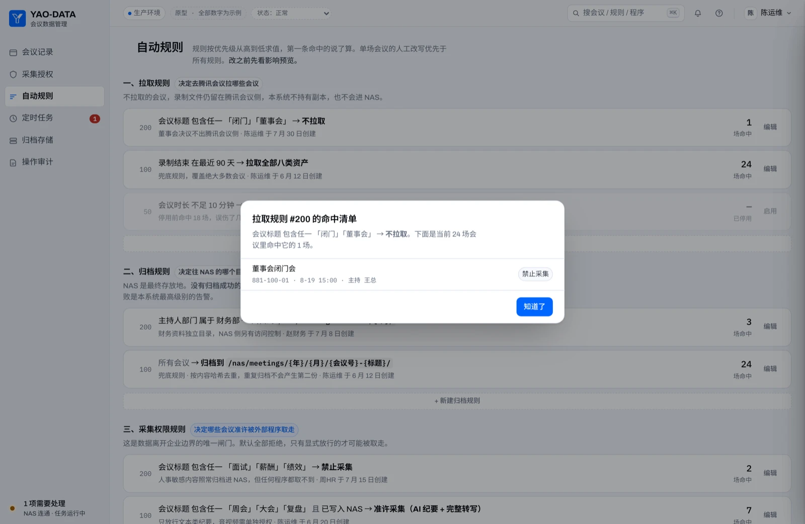

### 4.8 定时任务

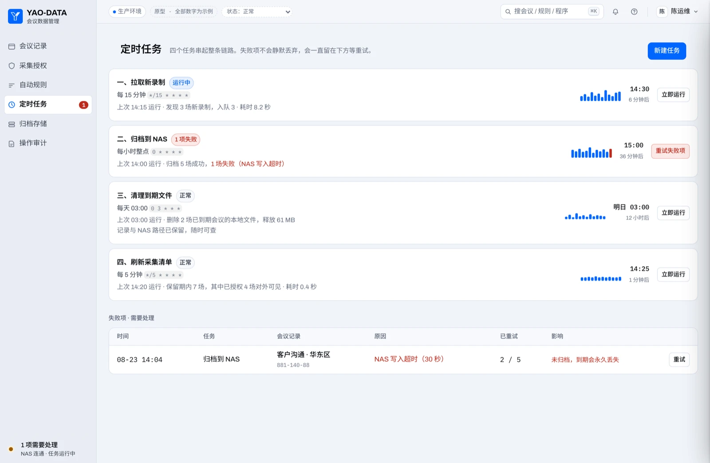

四个任务串起整条链路：

| 任务 | 频率 | 干什么 |
| --- | --- | --- |
| 一、拉取新录制 | 每 15 分钟 | 发现新录制并入队 |
| 二、归档到 NAS | 每小时整点 | 写入 NAS 并校验哈希 |
| 三、清理到期文件 | 每天 03:00 | 删本地文件，**记录与 NAS 路径保留** |
| 四、刷新采集清单 | 每 5 分钟 | 重算哪些会议对哪些程序可见 |

- 每个任务带一条**近期运行的 sparkline**，失败的那次是红的
- **失败项不会静默丢弃**，会一直留在下方的「失败项 · 需要处理」表里等重试，
  且明写影响（「未归档，到期会永久丢失」）和已重试次数（`2 / 5`）

### 4.9 归档存储

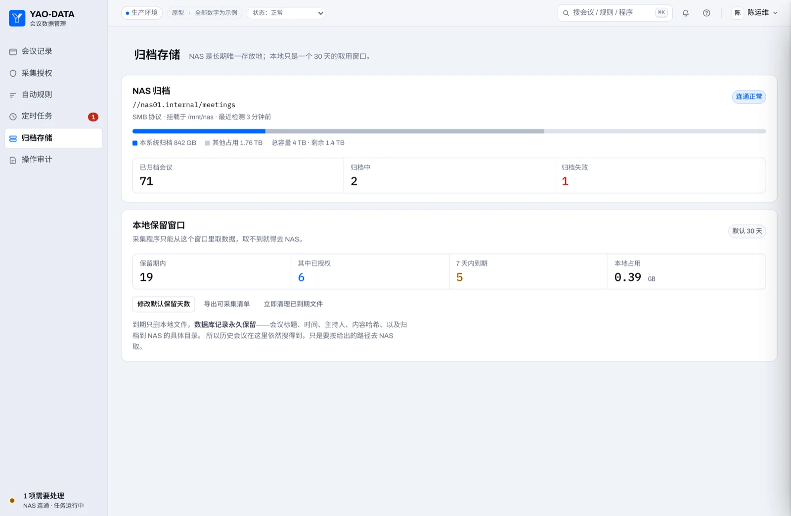

两块：

- **NAS 归档** —— 挂载点、协议、连通状态、最近检测时间、容量占用（本系统 / 其他 / 剩余）、
  已归档 / 归档中 / 归档失败
- **本地保留窗口** —— 保留期内 / 其中已授权 / 7 天内到期 / 本地占用，
  以及三个动作：修改默认保留天数、导出可采集清单、立即清理已到期文件

页面底部那段话是产品模型的复述，必须留着：

> 到期只删本地文件，**数据库记录永久保留**——会议标题、时间、主持人、内容哈希、
> 以及归档到 NAS 的具体目录。所以历史会议在这里依然搜得到，只是要按给出的路径去 NAS 取。

### 4.10 操作审计

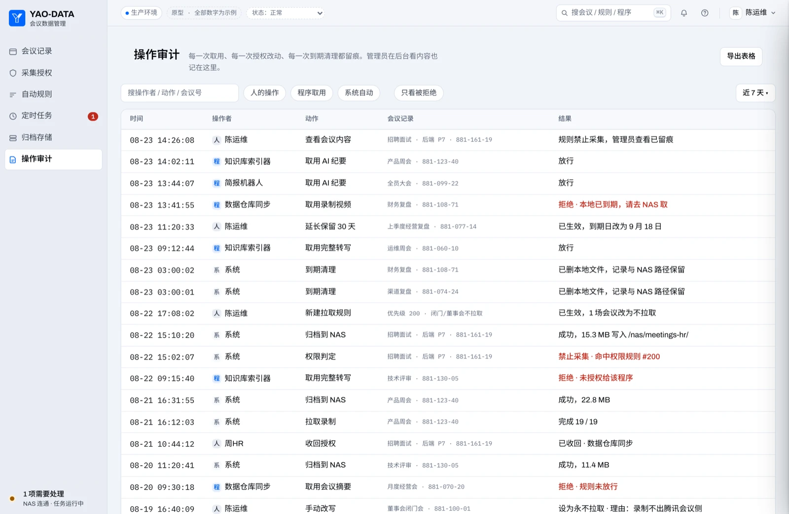

一行一次访问。**人和程序混在同一条流里**，用左侧色块区分（`prog` 蓝 / `person` 中性 / `sys` 灰）。

字段：时间 · 操作者 · 动作 · 对象（会议标题 + 会议号）· 结果。

- **被拒绝的记录是红的**，且写明拒绝原因（「拒绝 · 本地已到期，请去 NAS 取」）
- 管理员查看规则禁止采集的会议，这里会有一条「规则禁止采集，管理员查看已留痕」
- 支持按操作者 / 类型 / 时间范围筛选

---

## 5. 规则引擎语义

**这一节需要逐字实现，不能凭直觉。**

### 5.1 求值

```
对某一类规则（fetch / archive / allow）：
  1. 取出该类中 enabled 的全部规则
  2. 按 priority 降序排序
  3. 从上往下找第一条匹配的，用它的 effect，立即停止
  4. 一条都不匹配时用兜底：allow 类 → deny，其余 → skip
```

**第一条命中的说了算**，不做合并、不做叠加。

两条必须写死的细节：

1. **同优先级的平局**：按 `id` 升序，先建的先命中。不按 effect 决定平局——
   「deny 优先」是另一套语义（合并式），与本节的「第一条说了算」互斥，混用会让
   规则列表的顺序不再是判定顺序，管理员就读不出结果了。
2. **与现有实现相反**：`src/policy/engine.ts` 当前按 priority **升序**取第一条，
   且同优先级 deny 优先。阶段 3 的 R1 以本节为准重写，**并且必须写迁移**：
   迁移跑完后拿迁移前的规则集与会议集重算一遍，判定结果逐条比对，不一致的列出来
   交人工确认——不许脚本自行决定。

### 5.2 单条规则的匹配

```
无条件（conds 为空）           → 匹配一切
join === 'or'                  → 任一条件成立即匹配
join === 'and'（默认）         → 全部条件成立才匹配
```

**一条规则内只有一个连接词**，不支持括号与混用。

### 5.3 可用字段与运算符

| 字段 | 运算符 | 值 |
| --- | --- | --- |
| 会议标题 `title` | 包含任一 / 不包含 | 关键词，逗号分隔 |
| 主持人部门 `dept` | 属于 / 不属于 | 部门多选 |
| 主持人 `host` | 是 / 不是 | 人员 |
| 会议时长 `dur` | 大于 / 小于 | 分钟 |
| 录制结束 `age` | 在最近 N 天内 / 早于 N 天 | 天 |
| 归档状态 `arch` | 已写入 NAS / 未归档 | 无值 |

> **`dept` 依赖企微通讯录，网关目前没有这份数据。** 它是归档规则最自然的写法
> （「财务部的会议归到 /nas/meetings-finance/」），所以**不删这个字段**，而是把
> 「接企微通讯录 API + 部门同步」立成阶段 3 的前置任务 R0。
> 在 R0 落地前，规则编辑器里这个字段应当可见但禁用，并写明原因——
> 不要让它看起来能用却静默不匹配。
>
> **R0 已定为不做（2026-08-25）。** 接通讯录 API 的前提是有企业微信自建应用，
> 而这个应用**没有真建**——本地 `.env` 里 WECOM 三项是占位符，M3.5 的部署决策本就是
> 不建自建应用（`docs/m3.5-execution-plan.md` §2 决策 2），四条设备流程路由现在返回
> 501 `wecom_not_configured`。所以上面那条降级路径不是过渡状态，**是当前的最终形态**：
> 字段可见、禁用、写明原因。引擎里对 `dept` 条件**显式判不匹配**，且要能与「字段拼错」
> 区分开——判定理由要说得出「这个字段当前无数据源」。一条只有 `dept` 条件的规则
> 永远不会命中，规则列表要给出可见提示。将来真建了企微应用，R0 立刻回来。

### 5.4 人工改写

**单场会议的人工改写优先于所有规则。** 改写过的会议在列表里有标记，
且规则的影响预览要把它们排除在「会被改变」之外。

### 5.5 影响预览的计算范围

只在 `命中(旧规则) ∪ 命中(新规则)` 这个集合上算，**不是全部会议**。
把所有会议都列成「受影响」是虚假的规模感。

---

## 6. 数据模型

### 6.1 会议

```js
{
  id, title, code,            // 会议号 881-123-40
  when, host, dur,            // 8-21 14:00 · 邹研发 · 1:52
  assets, total,              // 已拿到 / 应有
  fetch:   'done' | 'running' | 'blocked' | 'none' | 'off',
  archive: 'done' | 'running' | 'failed' | 'off' | 'blocked' | 'none',
  // 'off' = 被人工关掉（圆点即开关，见原型 toggleStage）——既不是 blocked（规则拒绝），
  //         也不是 none（没东西可做）。两个阶段都有这个取值。
  // 'none' = 压根没有录制，无从决定。
  // 这两个取值原本都漏在本表外，因为种子数据里没有、只在运行时产生：
  //   ArchiveState 的 'none' 由 F1 Task 2 发现，FetchState 的 'off' 由 F1 Task 6 发现。
  allow:   'allow' | 'deny',
  grants:  ['知识库索引器', ...],   // 只有 allow 且在保留期内才有意义
  hand:    [],                      // 被人工改写过的阶段
  keep: { archivedOn, expiresOn, daysLeft, extended, filesGone },
  nas, size,
  why: { fetch: {by, text}, archive: {...}, allow: {...} },  // 逐阶段判定理由
  hist: [[时间, 事件], ...]
}
```

`why.by` 的取值决定理由的呈现样式：`rule`（来自规则）· `hand`（人工改写，琥珀）·
`fail`（失败，红）· `expired` / `wait` / `na`（生命周期原因，优先级高于权限原因）。

### 6.2 八类资产

| key | 名称 | 网关 `asset_type` |
| --- | --- | --- |
| `summary` | AI 纪要 | `ai_minutes` |
| `transcript` | 完整转写 | `meeting_summary` |
| `speaker` | 发言人纪要 | `ai_speaker_minutes` |
| `topic` | 话题纪要 | `ai_topic_minutes` |
| `aitr` | AI 转写 | `ai_meeting_transcripts` |
| `digest` | 会议摘要 | `ai_ds_minutes` |
| `video` | 录像 | `video` |
| `audio` | 音频 | `audio` |

**这一列的权威在代码里，不在本表**：`packages/engine/src/domain/types.ts` 的
`ASSET_KEY_TO_GATEWAY_TYPE` 是唯一事实源，本表只是它的人类可读副本。两处不一致时以代码为准。

左列那套短名（`summary` / `aitr` / `digest`）**只是原型 HTML 内部的显示用键**。
前端工程化（F1）时必须直接采用 `AssetKey`，**不要把这套短名带进代码**——同一批资产
已经有过三套叫法，M3.5 为此吃过一次亏（见 `dev-plan.md` §5 C7）。

同一份录制的多种导出格式（txt / docx / pdf）**共享同一个 `record_file_id`**，
只有 `file_type` 能区分它们——这个坑已经在 `client/src/store/db.ts` 的 schema v2
里踩过并修了，控制台侧的资产计数必须沿用同样的唯一键。

### 6.3 规则

```js
{ id, kind: 'fetch'|'archive'|'allow', pri, enabled,
  join: 'and'|'or', conds: [{ f, op, v }], effect,
  note,          // 说明，会出现在规则列表和每场会议的判定理由里
  author, on }   // 谁在什么时候建的
```

**主体（谁）在三栈里的含义不同**：

| 栈 | 主体 | 说明 |
| --- | --- | --- |
| 拉取 `fetch` | **无** | 系统级行为，不针对任何人 |
| 归档 `archive` | **无** | 同上 |
| 采集权限 `allow` | **采集程序** | 不是人。对应 `service_accounts.id` |

现有 `policy_rules.subject_type` 只认 `user`，需增加 `program` 取值；fetch / archive
两栈的主体列留空，并在引擎里**显式忽略**（不是「恰好匹配不上」）。

### 6.4 采集程序

```js
{ id, name, scope }   // kb-indexer · 知识库索引器 · 'AI 纪要 + 完整转写'
```

---

## 7. 系统状态与降级

控制台依赖三个外部系统，**它们各自挂掉的后果完全不同**，所以告警等级和给出的
操作也不一样。

| 依赖 | 挂了会怎样 | 等级 |
| --- | --- | --- |
| 腾讯会议接口 | 只影响拉新的。已拉下来的会议、归档、对外采集都不受影响 | 琥珀 |
| **NAS 归档存储** | **最要命**。归档不成功的会议，本地保留期一到就彻底没有了——这是本系统唯一不可逆的损失 | 红 |
| 数据库 | 整个后台读不出数据，但不会丢东西——文件还在，记录还在 | 红 |

### 7.1 腾讯会议不可达

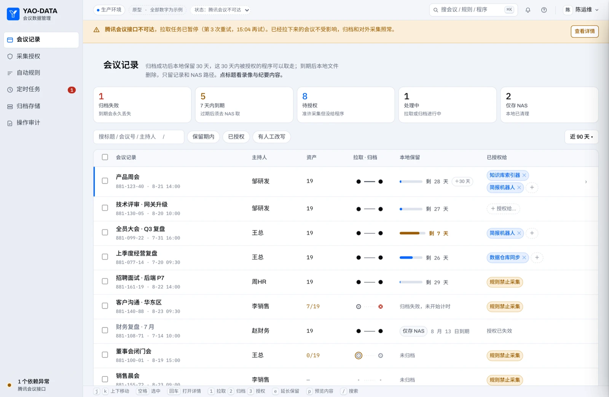

### 7.2 NAS 断连

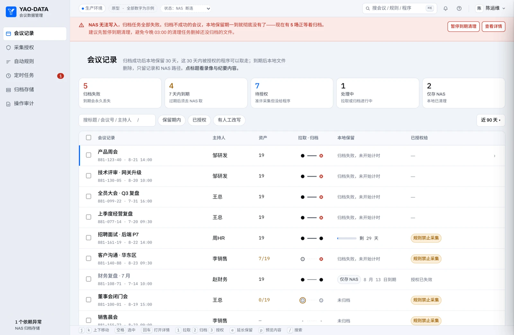

**故障必须在数据里可见，不能只是一条横幅。** NAS 断连时：

- 分诊条的「归档失败」从 1 变成 5
- 受影响会议的保留窗口被清零（它们本来就不该开始计时）
- 它们的授权被撤下（没归档成功的东西不该对外可见）
- 告警条上直接给**「暂停到期清理」**——这是唯一能阻止不可逆损失的动作，
  所以它必须在告警条本身上

---

## 8. 空 / 加载 / 错误三态

| | |
| --- | --- |
| 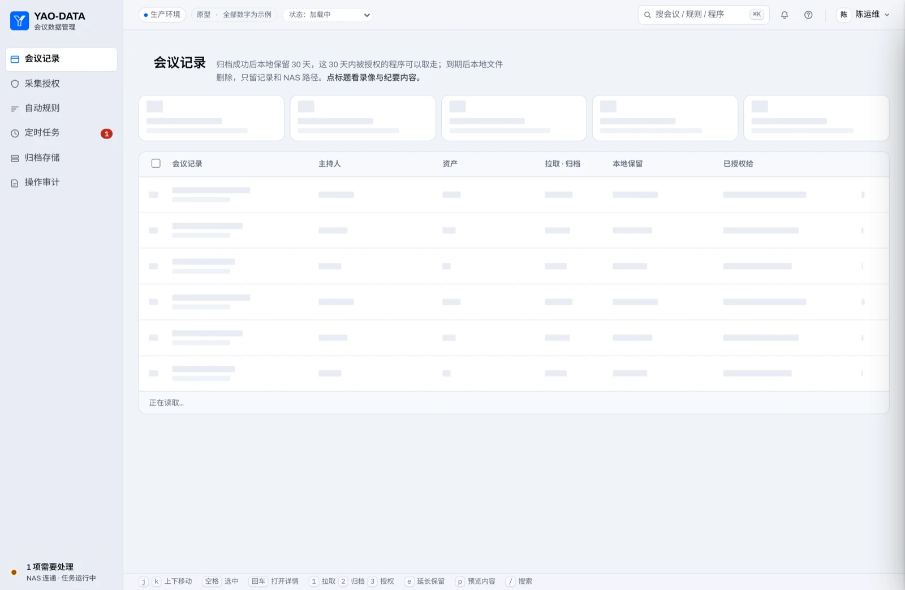 | 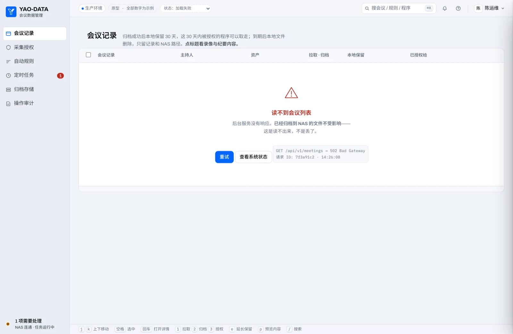 |
| **加载中** —— 骨架屏按真实行的几何画，宽度不齐；**分诊条也用骨架卡**，不隐藏（否则布局会跳） | **加载失败** —— 给出错误详情与重试 |

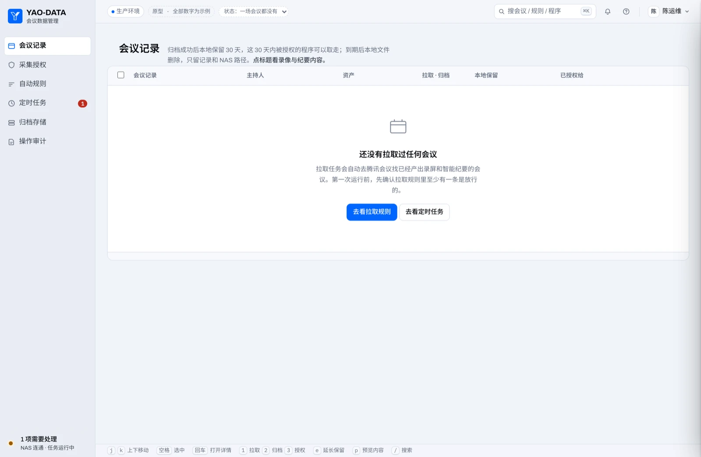

**空态分三种，出口各不相同**：筛选筛没了 / 这段时间没有 / 系统里一场都没有。
用同一句「暂无数据」把三者糊在一起，人就不知道下一步该做什么。

---

## 9. 键盘操作

底部常驻一条快捷键条：

| 键 | 动作 |
| --- | --- |
| `j` `k` | 上下移动 |
| `空格` | 选中 |
| `回车` | 打开详情 |
| `1` `2` `3` | 拉取 / 归档 / 授权 |
| `e` | 延长保留 |
| `p` | 预览内容 |
| `/` | 搜索 |
| `Esc` | 关闭当前浮层 |

原型这张表里还有一行 `⌘K` 全局搜索，2026-08-28 **删掉**：`console/src/lib/keys.ts`
对带修饰键的按键一律返回 `null`，全应用没有人监听这个键，顶栏那颗按钮的 `onClick`
也是空的。功能本身仍然是想做的（§11 第 6 行），做出来时把键位绑定和这一行一起加
回来——但在那之前，一张写着做不到的事的快捷键表比没有这一行更糟。

---

## 10. 明确不做（YAGNI）

- **AI 问答**（把会议内容送给模型）—— 见 §1.4。写了条件，没有实现；**界面上也不
  留位置**（2026-08-28 起，内容预览页不再渲染那块说明，见 §1.4）
- **企微扫码登录控制台** —— 控制台走独立的账号密码体系（D1，2026-08-23）。
  它是 1–3 人的运维面板，价值恰在 NAS 断连、企微不可达这类故障时，**登录不能依赖
  另一个可能同时挂掉的系统**。这不是「以后再说」，是明确不做
- **多租户 / 多企业** —— 单企业部署
- **自助注册 / 找回密码** —— 管理员由系统管理员开通
- **移动端完整体验** —— 移动端只保证「能看」，不保证「能改」，见 §11
- **新建定时任务** —— §4.8 的四个任务是 `src/store/jobs.ts` 里 `JOB_CATALOG` 的四个
  常量，不是一张表。要开放自定义任务，先得回答「执行体从哪来」——那是一个新子系统
  （沙箱、依赖、失败语义、权限），不是一个表单。而这四个任务已经串起了整条链路
  （拉取 → 归档 → 清理 → 刷新采集清单），没有第五件事非做不可。原型里那个「新建任务」
  按钮点了只弹一句「还没做」，**F5a 已经把它删掉**：一个承诺了不存在的功能的按钮，
  比没有这个按钮更差（阶段 5 计划裁定 G-g，2026-08-26）

---

## 11. 原型未覆盖的缺口

**原型列的五条都补上了**（阶段 5：后端 A8 补端点，前端 F7 接线，2026-08-27）。
下表留着，因为「当初缺的是什么、后来怎么补的」比一张空表有用。

**但这张表不是空的**：第 6、7 行都是 2026-08-28 新登记的。上一版这里写着「五条现在
都不再是缺口了」，那句话在写下的当天就已经不准——`docs/superpowers/specs/2026-07-20-user-stories.md`
§9 的核对表第 7 行点名批评过一种模式：**缺口只活在一行代码注释里**。所以新缺口
一律登记到这张表，代码里那句注释是指路，不是记录。

第 7 行还补了这条规矩的另一半：**缺口也不许活在界面文案里**。把「这个按钮为什么
不存在」写成抽屉里的一段话，比藏在代码注释里更糟——注释只骗开发者，界面文案是
拿管理员的注意力去养一条开发笔记。

| # | 缺口 | 处置 |
| --- | --- | --- |
| 1 | ~~只读角色~~ | **已做**。`admin_accounts.role`（迁移 009）+ 18 条写端点逐条 403 + 前端按 `role` 降级。用户菜单那一行随角色变，不再写死「数据管理员 · 可改规则与授权」 |
| 2 | ~~移动端表格~~ | **已做**。窄屏（≤56em）断点：左栏收到顶上、导航换行不横滚、顶栏换行、表格一行一张卡片、批量条改 left/right 双锚定。`npm run a11y` 在 375px 下不再有任何已知缺口 |
| 3 | ~~新建定时任务~~ | **已裁定不做，见 §10**。按钮已在 F5a 删掉 |
| 4 | ~~轮换凭据 / 停用程序~~ | **已做**。`PATCH /programs/:id` 与 `POST /programs/:id/rotate-secret`；新 secret 一次性展示，服务端只存哈希、没有「再看一次」 |
| 5 | ~~账号设置 / 修改密码~~ | **已做**。`POST /auth/password`，要填当前密码；改完吊销该账号的其它会话、保留当前这一条，界面上把被踢下线的会话数说出来 |
| 6 | **全局搜索（会议 / 规则 / 程序）** | **未做，2026-08-28 登记**。顶栏原有一颗「搜会议 / 规则 / 程序」按钮，`onClick` 是空的，还印着 `⌘K` 徽标——而 `console/src/lib/keys.ts` 对带修饰键的按键一律返回 `null`，全应用没人监听这个键。按钮已删（`GlobalBar.tsx`，`tests/shell.test.tsx` 钉住「顶栏不许有搜会议按钮、全文档不许出现 ⌘K」），同一句谎也已从 `ShortcutBar` 里删掉。**删的是那两句假话，不是这个需求**：做出来的时候把按钮和键位绑定一起加回来 |
| 7 | **撤销归档** | **未做，2026-08-28 登记**。语义见 §4.3 脚注 [1]（2026-08-25 定案：只撤归档记录、NAS 副本保留，可逆、不需要二次确认），对应 [用户故事 US-2.5](../superpowers/specs/2026-07-20-user-stories.md)，后端 0 实现、无端点。控制台**不放这个按钮**：能做到的最接近的动作是「人工改写」（`PUT /override`，effect=skip），它关掉归档阶段但**不撤销已经发生的那一次归档**，在一个"归档记录没了就等于丢了"的系统里，一个名字对、动作不对的按钮是最贵的误导。此前归档段里渲染着一整段解释这个按钮为什么不存在的话（`undo-archive-gap`），2026-08-28 删除——**界面回答「我现在要做什么」，缺口的账本是这张表**。`console/tests/meetings.test.tsx` 钉住「抽屉里一个『撤销归档』都不出现」，源码注释（`MeetingDetail.tsx`）指回这一行 |

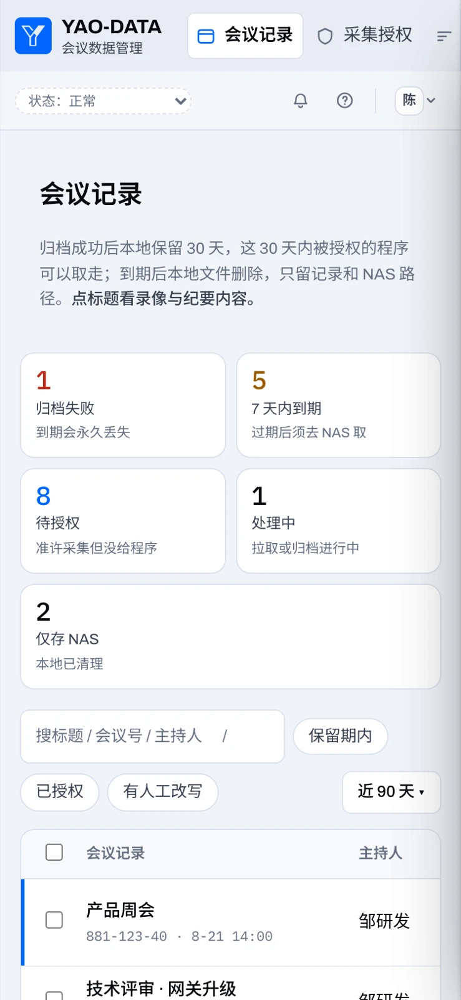

> **上面这张图是 F7 之前的现状，不是现在的样子。** 图里的状态是「导航横向滚动、
> 分诊条两列、表格横向滚动」——**能看，不好用**。F7 之后：导航换行、分诊条两列
> （明说的两列，不再是 `min-width` 撞出来的）、表格一行一张卡片，列名由每个格子
> 自己带。截图还没重拍。

**移动端的边界没有变**：§10 仍然写着「移动端只保证『能看』，不保证『能改』」。
卡片化解决的是「够不着」，不是把这一面板变成一个手机应用——**窄屏下「全选本页」
没有位置放**（表头在卡片形态下不渲染），批量操作因此只能逐场做。

---

## 12. 深色模式

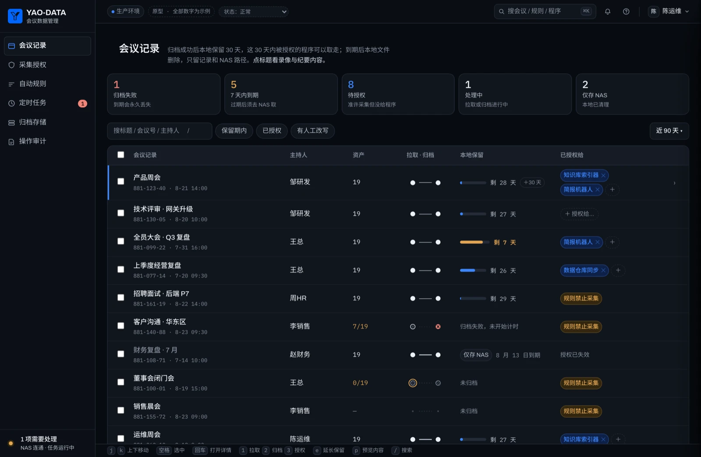

三态：跟随系统 / 强制浅色 / 强制深色。两种主题下全页文字对比度均已实测达 WCAG AA
（详见 [`design-system.md` §5](design-system.md#5-无障碍基线)）。
